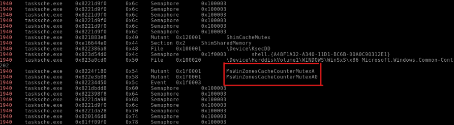

# Glossary

1. [Introduction](#1-introduction)
2. [Orientations](#2-orientations)
3. [Code Only](#3-code-only)
4. [About Me](#4-about-me)
5. [Original Version](https://github.com/Samu3lb0az/WriupVolatility.git)
6. [Licença](LICENSE)

## **1. Introduction**

**Objective**: This writeup was developed to assist in the **understanding of the tasks** in the **TryHackMe Volatility – Task 10: Investigations** lab, providing a practical execution guide directly on the virtual machine provided by the platform. The environment already includes all pre-installed requirements (Python 3, **Volatility** tools, and necessary memory files), allowing you to focus on forensic analysis without configuration concerns.

**Tool**: Volatility 3.

**Note on `windows.info`**: when using the `windows.info` plugin after specifying the memory image's operating system, Volatility not only confirms the OS but also displays important details such as the exact Windows version, the machine architecture (e.g., x64 or x86), and the running kernel version. These details can be useful for understanding plugin compatibility and better interpreting command output.

**A tip I received from a friend is that TryHackMe provides the character count and indicates if special characters are present, which makes finding the correct answer easier. With that small tip, I managed to find several answers just by analyzing the plugin output.**

## 2. Orientations

These guidelines apply to Task 10 of the Volatility module on the TryHackMe platform, specifically to the forensic investigation scenario in memory images.

It is important to note that all Task 10 activities are performed directly on the TryHackMe virtual machine, which can be started from Task 3.

---

**What is the build version of the host machine in Case 001?**

This challenge is carried out based on concepts presented in previous tasks. We use the `windows.info` plugin, which provides detailed information about the operating system loaded in the memory image. For **Case 001**, the command is:

```bash
vol -f /Scenarios/Investigations/Investigation-1.vmem windows.info
```

The plugin will display the Windows build version, the system edition, and the machine type (x64). Use these details to answer the prompt.

---

**At what time was the memory file acquired in Case 001?**

In this challenge, we reuse the `windows.info` plugin. By executing the same command above, in addition to the build, Volatility shows the memory acquisition timestamp (date and time when the dump was created). This information is listed right after the OS metadata, making it easy to locate the exact timestamp.

```bash
vol -f /Scenarios/Investigations/Investigation-1.vmem windows.info
```

---

**What process can be considered suspicious in Case 001?**
**Note:** Certain special characters may not be visible on the provided VM. When doing a copy-and-paste, it will still copy all characters.

To identify the suspicious process, we use the `windows.pslist` plugin, which generates a list of all running processes, showing PID, PPID, and names. The analysis involves examining atypical processes or those with masked names by observing the PID and PPID columns.

```bash
vol -f /Scenarios/Investigations/Investigation-1.vmem windows.pslist
```

Search for entries with unfamiliar names or containing special characters. Note the full process name (including any invisible characters) to answer the prompt.

---

**What is the parent process of the suspicious process in Case 001?**

This prompt follows the previous challenge, using the `windows.pslist` output again. Locate the suspicious process line, note the **PPID** (Parent Process ID) column value, then find the process whose **PID** matches that PPID to discover the parent process name.

```bash
vol -f /Scenarios/Investigations/Investigation-1.vmem windows.pslist
```

Identifying the parent process only requires cross-referencing PPID and PID in the same output table, making the search straightforward.

---

**What is the PID of the suspicious process in Case 001?**

Again, with `windows.pslist`, locate the same suspicious process line and copy the **PID** column value. This information is immediately next to the process name.

```bash
vol -f /Scenarios/Investigations/Investigation-1.vmem windows.pslist
```

---

**What is the parent process PID in Case 001?**

For this challenge, after identifying the parent process in the previous step, remain on the `windows.pslist` output and copy the PID corresponding to the identified parent process.

```bash
vol -f /Scenarios/Investigations/Investigation-1.vmem windows.pslist
```

---

**What user-agent was employed by the adversary in Case 001?**

Here we combine two plugins. First, we use `windows.memmap` to map and dump the memory of the suspicious process (PID obtained earlier). The `--dump` flag generates dump files:

```bash
vol -f /Scenarios/Investigations/Investigation-1.vmem windows.memmap --pid 1640 --dump
```

Next, we extract strings from the dump and filter for the term "User-Agent":

```bash
strings *.dmp | grep -i "user-agent"
```

The result will display the exact `User-Agent` header value used by the malware.

---

**Was Chase Bank one of the suspicious bank domains found in Case 001? (Y/N)**

Based on the memory dump and extracted strings, determine if "chase.com" or variations appear among the listed domains. If present, answer **Y**; otherwise, **N**.

---

**What suspicious process is running at PID 740 in Case 002?**

For **Case 002**, change only the input memory file and repeat the process listing:

```bash
vol -f /Scenarios/Investigations/Investigation-2.raw windows.pslist
```

Locate the line with PID 740 and copy the suspicious process name shown there.

---

**What is the full path of the suspicious binary in PID 740 in Case 002?**

Use the `windows.dlllist` plugin to list all libraries and paths associated with running processes, filtering by PID 740:

```bash
vol -f /Scenarios/Investigations/Investigation-2.raw windows.dlllist | grep 740
```

The full executable path will be among the entries listed for that PID.

---

**What is the parent process of PID 740 in Case 002?**

Reuse `windows.pslist` in **Case 002** and, as in Case 001, identify the PPID column for the line with PID 740, then find the process whose PID matches that PPID.

```bash
vol -f /Scenarios/Investigations/Investigation-2.raw windows.pslist
```

---

**What is the suspicious parent process PID connected to the decryptor in Case 002?**

Again, from the `windows.pslist` table, find the parent process PID that interacts with the decryptor, observing the PID and PPID columns.

---

**From our current information, what malware is present on the system in Case 002?**

Based on the process name (e.g., “@WanaDecryptor@”), correlate it with known malware. In this scenario, the process corresponds to **WannaCry**.

---

**What DLL is loaded by the decryptor used for socket creation in Case 002?**

Use `windows.dlllist` again, filtering by the decryptor process PID (740), and identify the DLL responsible for socket creation:

```bash
vol -f /Scenarios/Investigations/Investigation-2.raw windows.dlllist | grep 740
```

Note: watch for DLLs like `ws2_32.dll` or similar, indicating network calls.

---

**What mutex can be found that is a known indicator of the malware in question in Case 002?**

To discover the mutex used by the malware, we use the `windows.handles` plugin and filter by the relevant PID:

```bash
vol -f /Scenarios/Investigations/Investigation-2.raw windows.handles | grep 1940
```

Using the `handles` plugin and `grep`. After reviewing all the information brought up when the plugin is executed, it's possible to find two elements, one of which is the answer:



---

**What plugin could be used to identify all files loaded from the malware working directory in Case 002?**

After familiar research in the Volatility documentation, the recommended plugin is `windows.vadinfo`, which displays the Virtual Address Descriptor and can list files mapped into the process memory space:

```bash
vol -f /Scenarios/Investigations/Investigation-2.raw windows.vadinfo --pid 740
```

## 3. Code Only

Commands used:

```bash
vol -f /Scenarios/Investigations/Investigation-1.vmem windows.info
```

```bash
vol -f /Scenarios/Investigations/Investigation-1.vmem windows.pslist
```

```bash
vol -f /Scenarios/Investigations/Investigation-1.vmem windows.memmap --pid 1640 --dump
```

```bash
strings *.dmp | grep -i "user-agent"
```

```bash
vol -f /Scenarios/Investigations/Investigation-2.raw windows.pslist
```

```bash
vol -f /Scenarios/Investigations/Investigation-2.raw windows.dlllist | grep 740
```

*I strongly recommend reviewing the [Orientations](#2-orientations) section to avoid conflicts or misunderstandings.*

---

## 4. About Me

*Summary of information about the author.*
